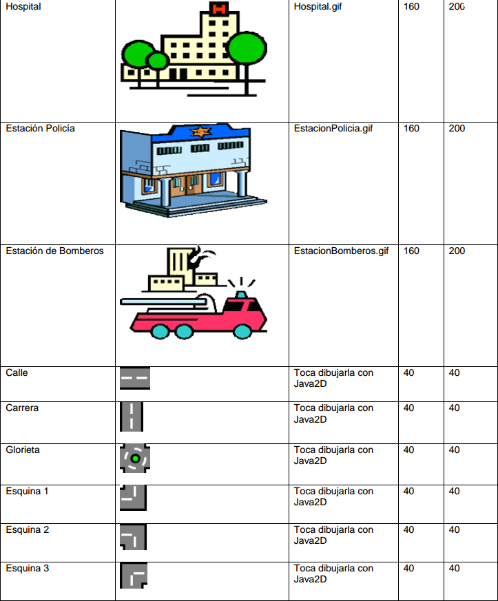

# Enunciado

Se desea construir una aplicación llamada MapaCiudad que permita 
la creación de un mapa sencillo de una ciudad.
Dicho mapa está constituido por construcciones que comparten
características sobre la forma en que son creadas.

Todas las construcciones tienen unas dimensiones (alto y ancho, medidas
en pixels), un color de fondo, un punto (x, y) que corresponde a la
esquina superior izquierda donde se va a ubicar la construcción, y
un texto que puede ser modificado y visualizado.

Las construcciones se encuentran divididas en edificaciones y
carreteras. Una edificación puede ser una casa, un edificio, un
hospital, una estación de policía o una estación de bomberos.
Las carreteras pueden ser calles, carreras, glorietas y esquinas.
La tabla siguiente muestra esos elementos de la ciudad.

Para dibujar una construcción en el mapa se debe seleccionar el tipo
de construcción entre las opciones disponibles y localizar el ratón
en la posición del mapa donde se quiere ubicar la construcción.
No se debe permitir sobreponer una construcción con otra.
Para tal fin, si la ubicación seleccionada esta libre, se debe
mostrar la silueta de la construcción.
Para crear la construcción basta hacer clic sobre la zona del mapa
seleccionada.

La aplicación debe permitir
(1) dibujar construcciones en el mapa,
(2) borrar construcciones del mapa,
(3) modificar el color de fondo de la figura que representa la
construcción,
(4) editar el texto que describe la construcción personalizando
sus atributos estilo, tamaño y tipo de fuente.
(5) guardar en un archivo un mapa que se acaba de construir y
(6) cargar un mapa existente.

# Interfaz

# Esquema de persistencia

Se describe a continuación el formato del archivo con el que la
aplicación MapaCiudad guarda el mapa.

El formato del archivo es:

Donde:

- La línea inicial indica el número de construcciones contenidas
en el archivo. De ahí en adelante hay 5 líneas
por cada construcción indicando lo que se describe a continuación.

###### Cada construcción está descrita en 5 líneas, como sigue:

- La primera línea de una construcción indica su tipo. Puede ser
CALLE, CARRERA, GLORIETA, ESQUINA1, ESQUINA2, ESQUINA3, ESQUINA4,
HOSPITAL, CASA, EDIFICIO, ESTACION_POLICIA o ESTACION_BOMBEROS.

- La segunda línea indica las coordenadas x y y del punto
superior izquierdo donde se va a ubicar la construcción.
Las coordenadas están separados por “;”.

- La tercera línea indica los valores de los componentes Rojo,
Verde y Azul del color en el sistema RGB del fondo de la construcción.

- La cuarta línea indica los atributos de la fuente usada para
mostrar el texto. La primera parte indica el nombre de la fuente,
la segunda indica el estilo (usando las constantes definidas en la
clase java.awt.Font) y la tercera indica el tamaño de la fuente.

- La quinta línea contiene el texto que describe la construcción.

Un ejemplo de este archivo es:

# Los sistemas de coordenadas

A continuación se exponen varios detalles útiles para el
desarrollo del proyecto

- Todas las unidades y medidas en el proyecto están dadas en pixels.
 
- Java2D dibuja sobre una superficie de pixels, cuya dimensión
depende del panel en donde se esté dibujando

- El origen de coordenadas se encuentra en la posición(0,0) que
está situado en la esquina SUPERIOR IZQUIERDA de la superficie de dibujo

- La primera coordenada se refiere a la FILA del píxel con el cual
está trabajando. Es creciente HACIA ABAJO.

- La segunda coordenada se refiere a la COLUMNA del píxel con el
cual se está trabajando. Es creciente hacia la derecha

Todo esto se ilustra en la figura siguiente:

Deben tener esto muy en cuenta, pues en el código las variables
de las coordenadas se llaman (x,y), que “inducen” a pensar en un
plano cartesiano, que tiene el origen en la esquina inferior
izquierda, la primera coordenada es creciente hacia la derecha y
la segunda coordenada es creciente hacia arriba.
